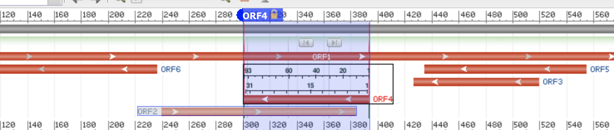

# Bioinformatics

(CMPSC 300) Activity 06

This repository contains information about Bioinformatics Activity 06: schooling your colleagues about skills obtained from watching tutorials.

## Dates

Handed out: 4 November 2022

Due: 11 November 2022



## Objectives
To learn how to use online tools in conjunction with stand alone programs. To determine differences in results from these two methods of analysis. To use BlastP to learn more about the ORF results.

## Reading Assignment
Chapter 10 in the Exploring Bioinformatics textbook.

## Introduction

We have been studying gene prediction technologies. We noted that there are often many types of tests involved with correctly predicting whether a gene is present in DNA, as noted in the Figure above.

In this activity, you are to compare the prediction qualities of a stand-alone Python program with the Open Reading Frame Finder tool which is available from NCBI at the below link.

[https://www.ncbi.nlm.nih.gov/orffinder/](https://www.ncbi.nlm.nih.gov/orffinder/)


### Steps

Please see steps in the `reflection.md` document where you are to follow steps and respond to questions after some of the steps.

## Working in Your Repository

As you are working on your assignment, you are to commit and push regularly. The commands are the following.

```
git add -A
git commit -m ``Your notes about the commit here''
git push
```

After you have pushed your work to your repository, please visit the repository at the GitHub website (you may have to log-in using your browser) to verify that your files were correctly sent.

### Deliverable

Please complete the sections of the File: `writing/reflection.md`

## GatorGrade

You can check the baseline writing and commit requirements for this assignment by running department's assignment checking `gatorgrade` tool. To use `gatorgrade`, you first need to make sure you have Python3 installed (type `python --version` to check). If you do not have Python installed, please see:

- [Setting Up Python on Windows](https://realpython.com/lessons/python-windows-setup/)
- [Python 3 Installation and Setup Guide](https://realpython.com/installing-python/)
- [How to Install Python 3 and Set Up a Local Programming Environment on Windows 10](https://www.digitalocean.com/community/tutorials/how-to-install-python-3-and-set-up-a-local-programming-environment-on-windows-10)

Then, if you have not done so already, you need to install `gatorgrade`:

- First, [install `pipx`](https://pypa.github.io/pipx/installation/)
- Then, install `gatorgrade` with `pipx install gatorgrade`

Finally, you can run `gatorgrade`:

`gatorgrade --config config/gatorgrade.yml`

## Assessment

This grade is a check mark.
